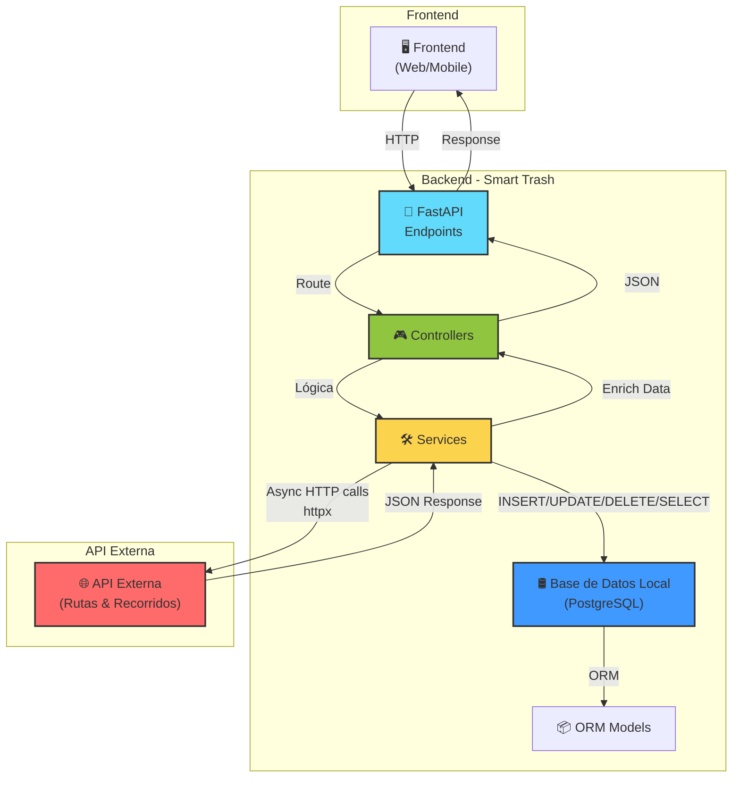
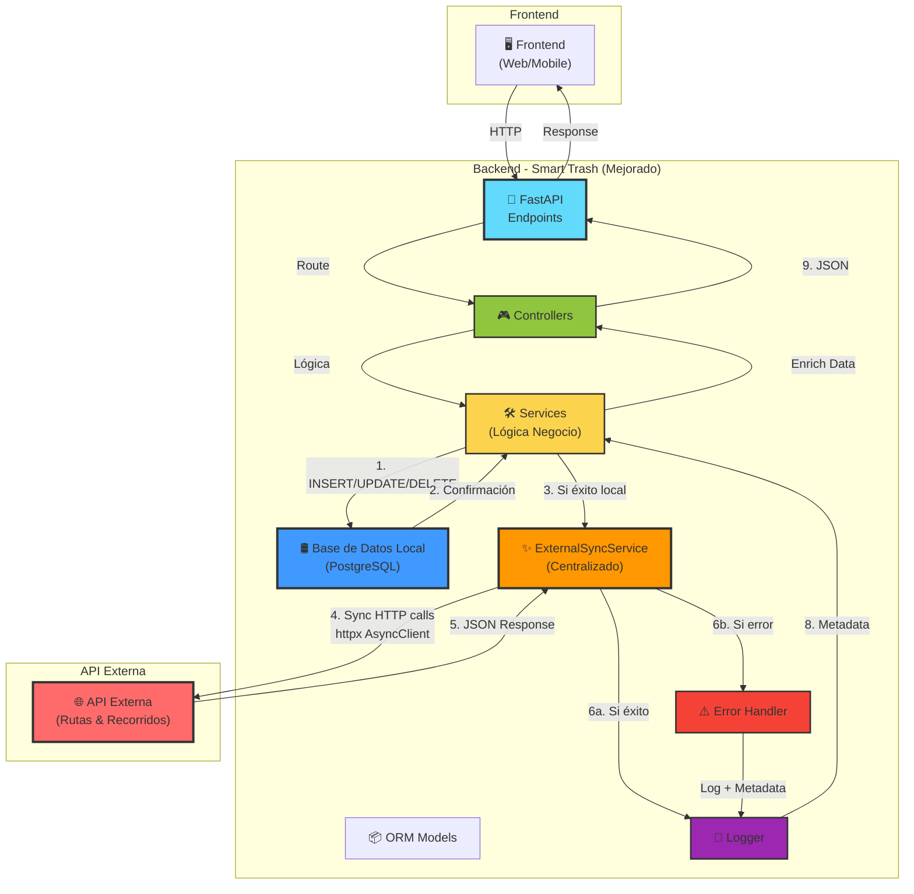

# 📊 ANÁLISIS DE ARQUITECTURA: SINCRONIZACIÓN BIDIRECCIONAL

## 📋 Tabla de Contenidos

1. [Descubrimiento de Endpoints](#descubrimiento-de-endpoints)
2. [Matriz de Operaciones CRUD](#matriz-de-operaciones-crud)
3. [Diagrama de Flujo Actual](#diagrama-de-flujo-actual)
4. [Diagrama de Flujo Propuesto](#diagrama-de-flujo-propuesto)
5. [Riesgos e Inconsistencias](#riesgos-e-inconsistencias)
6. [Especificación de Cambios](#especificación-de-cambios)

---

## Descubrimiento de Endpoints

### 🛢️ OPERACIONES EN BD LOCAL

#### 1. **Asignaciones de Rutas** (`AsignacionRutas`)

| Método | Endpoint                              | Controlador                                           | Servicio                                                | BD        | API Ext    | Estado                    |
| ------ | ------------------------------------- | ----------------------------------------------------- | ------------------------------------------------------- | --------- | ---------- | ------------------------- |
| POST   | `/admin/asignaciones`                 | `controller_asignacionrutas.crear_asignacion`         | `AsignacionService.crear_asignacion`                    | ✅ CREATE | ❌         | Sin sincronizar           |
| GET    | `/admin/asignaciones`                 | `controller_asignacionrutas.listar_asignaciones`      | `AsignacionService.obtener_asignaciones`                | ✅ READ   | ❌         | Sin sincronizar           |
| GET    | `/admin/asignaciones/{id}`            | `controller_asignacionrutas.obtener_asignacion_admin` | `AsignacionService.obtener_asignacion_id`               | ✅ READ   | ❌         | Sin sincronizar           |
| POST   | `/admin/asignaciones/{id}/cancelar`   | `controller_asignacionrutas.cancelar_asignacion`      | `AsignacionService.cancelar_asignacion`                 | ✅ UPDATE | ❌         | Sin sincronizar           |
| POST   | `/driver/asignaciones/{id}/iniciar`   | `controller_asignacionrutas.iniciar_recorrido`        | `AsignacionService.iniciar_recorrido_con_api_externa`   | ✅ UPDATE | ⚠️ Parcial | Sincronización incompleta |
| POST   | `/driver/asignaciones/{id}/finalizar` | `controller_asignacionrutas.finalizar_recorrido`      | `AsignacionService.finalizar_recorrido_con_api_externa` | ✅ UPDATE | ⚠️ Parcial | Sincronización incompleta |

#### 2. **Vehículos** (`Vehiculo`)

| Método | Endpoint                       | Controlador                                   | Servicio                                     | BD        | API Ext | Estado                 |
| ------ | ------------------------------ | --------------------------------------------- | -------------------------------------------- | --------- | ------- | ---------------------- |
| POST   | `/admin/vehiculos`             | `controller_vehiculo.crear_vehiculo`          | `VehiculoService.añadir_vehiculo`            | ✅ CREATE | ✅      | Sincronizado ✓         |
| GET    | `/admin/vehiculos`             | `controller_vehiculo.listar_vehiculos`        | `VehiculoService.obtener_todos_vehiculos`    | ✅ READ   | ✅      | Enriquecida            |
| GET    | `/admin/vehiculos/{id}`        | `controller_vehiculo.obtener_vehiculo`        | `VehiculoService.obtener_vehiculo_por_id`    | ✅ READ   | ✅      | Enriquecida            |
| PATCH  | `/admin/vehiculos/{id}`        | `controller_vehiculo.actualizar_vehiculo`     | `VehiculoService.actualizar_vehiculo_por_id` | ✅ UPDATE | ❌      | **SIN SINCRONIZAR** ⚠️ |
| PATCH  | `/admin/vehiculos/{id}/estado` | `controller_vehiculo.cambiar_estado_vehiculo` | `VehiculoService.cambiar_estado_vehiculo`    | ✅ UPDATE | ❌      | **SIN SINCRONIZAR** ⚠️ |
| DELETE | `/admin/vehiculos/{id}`        | `controller_vehiculo.eliminar_vehiculo`       | `VehiculoService.eliminar_vehiculo`          | ✅ DELETE | ❌      | **SIN SINCRONIZAR** ⚠️ |

#### 3. **Posiciones GPS** (`RecorridoPosicion`)

| Método | Endpoint                               | Controlador                                     | Servicio                               | BD        | API Ext | Estado             |
| ------ | -------------------------------------- | ----------------------------------------------- | -------------------------------------- | --------- | ------- | ------------------ |
| POST   | `/driver/asignaciones/{id}/posiciones` | `controller_posiciones.registrar_posicion`      | `PosicionesService.registrar_posicion` | ✅ CREATE | ✅      | Sincronizado ✓     |
| GET    | `/admin/asignaciones/{id}/posiciones`  | `controller_posiciones.listar_posiciones_admin` | `PosicionesService.listar_posiciones`  | ✅ READ   | ❌      | Solo lectura local |

#### 4. **Fotos** (`Foto`)

| Método | Endpoint                          | Controlador                             | Servicio                      | BD                  | API Ext | Estado                 |
| ------ | --------------------------------- | --------------------------------------- | ----------------------------- | ------------------- | ------- | ---------------------- |
| POST   | `/driver/asignaciones/{id}/fotos` | `controller_fotos.registrar_foto`       | `FotosService.registrar_foto` | ✅ CREATE           | ❌      | **SIN SINCRONIZAR** ⚠️ |
| GET    | `/admin/asignaciones/{id}/fotos`  | `controller_fotos.listar_fotos_admin`   | `FotosService.listar_fotos`   | ✅ READ             | ❌      | Solo lectura local     |
| GET    | `/uploads/fotos/{filename}`       | `controller_fotos.obtener_foto_archivo` | (Static file)                 | 🗂️ Sistema Archivos | ❌      | -                      |

#### 5. **Tripulación** (`Tripulacion`)

| Método | Endpoint               | Controlador                                   | Servicio                                   | BD        | API Ext | Estado                 |
| ------ | ---------------------- | --------------------------------------------- | ------------------------------------------ | --------- | ------- | ---------------------- |
| POST   | `/admin/tripulaciones` | `controller_tripulacion.crear_tripulacion`    | `TripulacionService.crear_tripulacion`     | ✅ CREATE | ❌      | **SIN SINCRONIZAR** ⚠️ |
| GET    | `/admin/tripulaciones` | `controller_tripulacion.listar_tripulaciones` | `TripulacionService.obtener_tripulaciones` | ✅ READ   | ❌      | Sin sincronizar        |

#### 6. **Usuarios** (`Usuario`)

| Método | Endpoint               | Controlador                              | Servicio                            | BD        | API Ext | Estado                 |
| ------ | ---------------------- | ---------------------------------------- | ----------------------------------- | --------- | ------- | ---------------------- |
| POST   | `/admin/usuarios`      | `controller_usuarios.crear_usuario`      | `UsuarioService.crear_usuario`      | ✅ CREATE | ❌      | **SIN SINCRONIZAR** ⚠️ |
| GET    | `/admin/usuarios`      | `controller_usuarios.listar_usuarios`    | `UsuarioService.obtener_usuarios`   | ✅ READ   | ❌      | Sin sincronizar        |
| PATCH  | `/admin/usuarios/{id}` | `controller_usuarios.actualizar_usuario` | `UsuarioService.actualizar_usuario` | ✅ UPDATE | ❌      | **SIN SINCRONIZAR** ⚠️ |
| DELETE | `/admin/usuarios/{id}` | `controller_usuarios.eliminar_usuario`   | `UsuarioService.eliminar_usuario`   | ✅ DELETE | ❌      | **SIN SINCRONIZAR** ⚠️ |

---

### 🌐 OPERACIONES EN API EXTERNA (Solo consumo)

#### Rutas (Solo lectura/creación externa)

| Método | Endpoint          | Servicio                         | Descripción               |
| ------ | ----------------- | -------------------------------- | ------------------------- |
| POST   | `/api/rutas`      | `APIExternaService.crear_ruta`   | Crear ruta en API externa |
| GET    | `/api/rutas`      | `APIExternaService.listar_rutas` | Listar rutas API externa  |
| GET    | `/api/rutas/{id}` | `APIExternaService.obtener_ruta` | Obtener ruta API externa  |

#### Recorridos (Lectora/escritura)

| Método | Endpoint                          | Servicio                                        | Descripción         |
| ------ | --------------------------------- | ----------------------------------------------- | ------------------- |
| POST   | `/api/recorridos/iniciar`         | `APIExternaService.iniciar_recorrido_externo`   | Iniciar recorrido   |
| POST   | `/api/recorridos/{id}/finalizar`  | `APIExternaService.finalizar_recorrido_externo` | Finalizar recorrido |
| POST   | `/api/recorridos/{id}/posiciones` | `APIExternaService.registrar_posicion_externa`  | Registrar posición  |
| GET    | `/api/recorridos/{id}/posiciones` | `APIExternaService.listar_posiciones_recorrido` | Listar posiciones   |

---

## Matriz de Operaciones CRUD

```
RESUMEN DE SINCRONIZACIÓN

Recurso          | CREATE | READ | UPDATE | DELETE | Status
-----------------|--------|------|--------|--------|----------
Asignaciones     | ❌     | ✅   | ⚠️(2)  | ❌     | CRÍTICO
Vehículos        | ✅     | ✅   | ❌     | ❌     | PROBLEMA
Posiciones       | ✅     | ✅   | -      | -      | PARCIAL
Fotos            | ❌     | ✅   | -      | -      | CRÍTICO
Tripulación      | ❌     | ✅   | -      | -      | CRÍTICO
Usuarios         | ❌     | ✅   | ❌     | ❌     | CRÍTICO
Reportes         | ❌     | ✅   | ❌     | ❌     | NO SYNC

Legend: ✅=Sincronizado, ⚠️=Parcial, ❌=No sincronizado, -=No aplica
(2)=Solo para iniciar/finalizar recorrido en específico
```

---

## Diagrama de Flujo Actual



**Problemas en el flujo actual:**

- 🔴 Sincronización **inconsistente** entre BD local y API externa
- 🔴 **Errores de API externa no siempre se manejan** (ver `actualizar_vehiculo` - no sincroniza)
- 🔴 Llamadas a API externa **dispersas en múltiples servicios**
- 🔴 **Duplicación** de lógica HTTP entre servicios
- 🔴 **Perdida de datos** si API externa falla en algunos casos

---

## Diagrama de Flujo Propuesto



**Mejoras en el flujo propuesto:**

- ✅ **Centralización** de sincronización en `ExternalSyncService`
- ✅ **Transaccionalidad local** primero, sincronización después
- ✅ **Error handling uniforme** y logging estructurado
- ✅ **BD local es fuente de verdad** (nunca se pierde)
- ✅ **Metadata de sincronización** para auditoría
- ✅ **Respuestas informativas** al cliente sobre estado de sincronización

---

## Riesgos e Inconsistencias

### 🔴 CRÍTICOS

| #   | Riesgo                                       | Impacto | Probabilidad | Causa                                                                                                             | Solución                                      |
| --- | -------------------------------------------- | ------- | ------------ | ----------------------------------------------------------------------------------------------------------------- | --------------------------------------------- |
| 1   | **Pérdida de datos en API externa**          | ALTO    | MEDIA        | Si `VehiculoService.actualizar_vehiculo()` falla, actualización local se aplica pero API externa no se sincroniza | Implementar sync en PATCH vehículos           |
| 2   | **Inconsistencia de estado de asignaciones** | ALTO    | ALTA         | `iniciar_recorrido()` intenta sincronizar pero si falla API externa, el estado local cambia igual                 | Usar transacciones distribuidas o sync retrys |
| 3   | **Duplicación de fotos**                     | MEDIO   | BAJA         | Las fotos se guardan en BD pero no se sincronizan a API externa (riesgo de no contar con evidencia)               | Implementar sync de fotos                     |

### ⚠️ ALTOS

| #   | Riesgo                                | Impacto | Probabilidad | Causa                                                                                         | Solución                              |
| --- | ------------------------------------- | ------- | ------------ | --------------------------------------------------------------------------------------------- | ------------------------------------- |
| 4   | **Orphaned registros en BD local**    | MEDIO   | MEDIA        | Si API externa crea pero BD local falla, se crea orfandad (ej: vehículo externo sin local)    | No existe actualmente, pero prevenir  |
| 5   | **Hardcoded perfil_id en posiciones** | BAJO    | ALTA         | `PosicionesService.registrar_posicion` usa hardcoded `"f105a9d3-13b3-4066-b5f7-edae6801e366"` | Pasar dinámicamente desde config      |
| 6   | **Falta de retry en API externa**     | MEDIO   | MEDIA        | Si API externa está temporalmente down, se pierde sincronización                              | Implementar exponential backoff retry |

### ℹ️ MEDIOS

| #   | Riesgo                        | Impacto | Probabilidad | Causa                                   | Solución                                     |
| --- | ----------------------------- | ------- | ------------ | --------------------------------------- | -------------------------------------------- |
| 7   | **Usuarios no sincronizados** | BAJO    | BAJA         | Usuarios se crean solo en BD local      | Evaluar si necesita sincronización           |
| 8   | **Reporte de tripulación**    | BAJO    | BAJA         | Tripulación se crea solo en BD local    | Evaluar si necesita sincronización           |
| 9   | **Timeout en API externa**    | MEDIO   | MEDIA        | No hay management de timeouts uniformes | Implementar timeout strategy en sync service |

---

## Especificación de Cambios

### Paso 1: Crear `ExternalSyncService`

**Archivo**: `services/external_sync_service.py`

**Responsabilidades:**

- Centralizar todas las operaciones de sincronización
- Manejo uniforme de errores (timeout, 4xx, 5xx)
- Logging estructurado
- Validación de respuestas
- Metadata de sincronización para auditoría

**Métodos a implementar:**

```
VEHÍCULOS:
  • sync_create_vehiculo(vehiculo_data) → (id_externo, sync_metadata)
  • sync_update_vehiculo(id_externo, vehiculo_data) → sync_metadata
  • sync_delete_vehiculo(id_externo) → sync_metadata

ASIGNACIONES:
  • sync_create_asignacion(asignacion_data) → sync_metadata
  • sync_update_asignacion(id_externo, asignacion_data) → sync_metadata

POSICIONES:
  • sync_create_posicion(posicion_data) → sync_metadata

TRIPULACIÓN:
  • sync_create_tripulacion(tripulacion_data) → sync_metadata
  • sync_update_tripulacion(id_externo, tripulacion_data) → sync_metadata
```

### Paso 2: Modificar `VehiculoService`

**Cambios:**

- Actualizar `actualizar_vehiculo_por_id()` para llamar a `ExternalSyncService`
- Actualizar `cambiar_estado_vehiculo()` para sincronizar con API externa
- Actualizar `eliminar_vehiculo()` para sincronizar con API externa
- Mantener compatibilidad si API externa falla

### Paso 3: Modificar `PosicionesService`

**Cambios:**

- Reemplazar `hardcoded perfil_id` por variable dinámica desde config
- Usar `ExternalSyncService` para todas las llamadas a API externa
- Mejorar logging

### Paso 4: Modelo de Metadata de Sincronización

**Nueva tabla/columna**: `SyncMetadata`

```python
class SyncStatus(str, Enum):
    PENDING = "pending"
    IN_PROGRESS = "in_progress"
    SUCCESS = "success"
    FAILED_RECOVERABLE = "failed_recoverable"
    FAILED_CRITICAL = "failed_critical"

class SyncMetadata:
    id_recurso: int
    tipo_recurso: str  # 'vehiculo', 'asignacion', 'posicion'
    operacion: str     # 'create', 'update', 'delete'
    estado: SyncStatus
    error_message: str | None
    intentos: int
    ultima_sincronización: datetime
```

---

## Resumen Ejecutivo

| Métrica                                     | Valor    |
| ------------------------------------------- | -------- |
| **Total Endpoints CRUD**                    | 21       |
| **Endpoints sin sincronización**            | 11 (52%) |
| **Endpoints con sincronización incompleta** | 6 (29%)  |
| **Endpoints sincronizados correctamente**   | 4 (19%)  |
| **Riesgos Críticos**                        | 3        |
| **Riesgos Altos**                           | 3        |
| **Riesgos Medios**                          | 3        |

**Conclusión**: Se requiere implementación urgente de `ExternalSyncService` centralizado para garantizar consistencia entre BD local y API externa.
